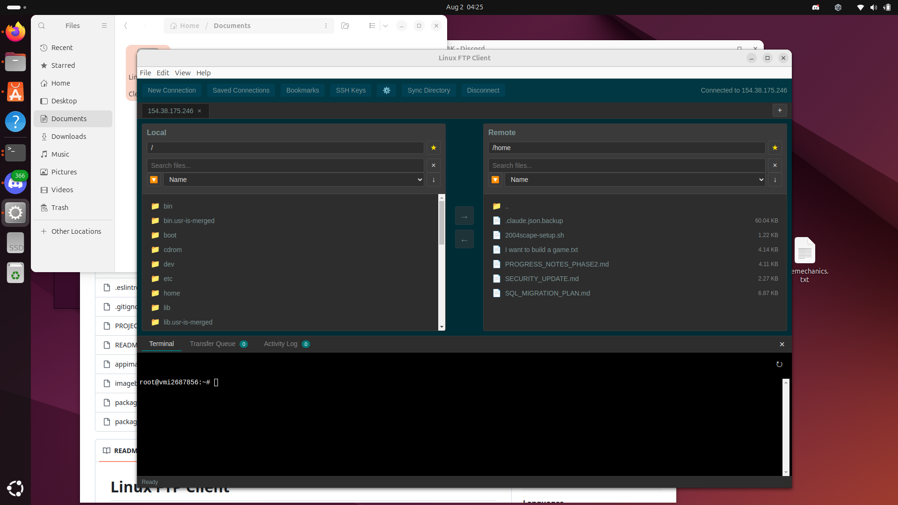
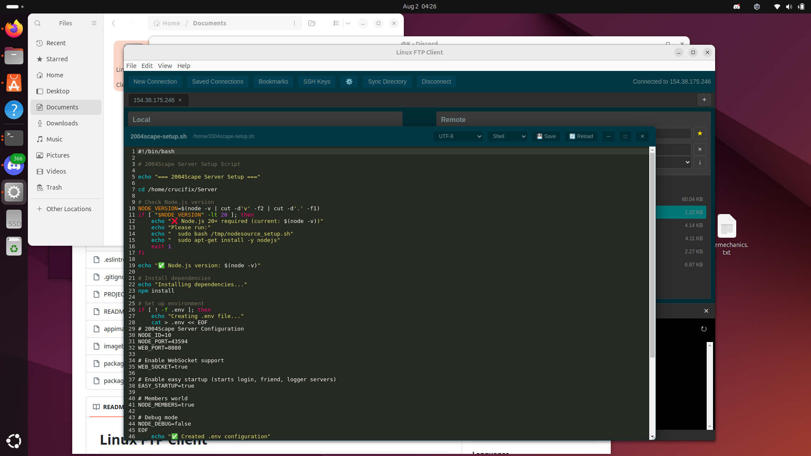

# Linux FTP Client

A modern FTP/SFTP client for Linux with an integrated terminal, inspired by WinSCP.

## Screenshots


*Dual-pane file browser with local and remote file management*


*Integrated terminal and file transfer capabilities*

## Features

- **Multi-protocol support**: FTP, FTPS, and SFTP
- **Dual-pane interface**: Local and remote file browsers side by side
- **Integrated terminal**: Built-in terminal emulator for SSH sessions
- **Connection profiles**: Save and manage connection credentials
- **File transfer**: Upload and download files with progress tracking
- **Dark theme**: Modern, easy-on-the-eyes interface

## Installation

```bash
# Clone the repository
git clone <repository-url>
cd linux-ftp-client

# Install dependencies
npm install

# Run the application
npm start
```

## Development

```bash
# Run in development mode with DevTools
npm run dev

# Run linter
npm run lint

# Build distributable
npm run build
```

## Usage

1. **New Connection**: Click "New Connection" to connect to a server
2. **Save Connection**: Enter a name in the "Save as" field to save the connection profile
3. **Saved Connections**: Click "Saved Connections" to view and manage saved profiles
4. **File Transfer**: 
   - Select files and use the arrow buttons to transfer
   - Double-click directories to navigate
5. **Terminal**: Automatically opens for SFTP connections, or toggle with Ctrl+T

## Keyboard Shortcuts

- `Ctrl+N`: New connection
- `Ctrl+T`: Toggle terminal
- `Ctrl+S`: Save connection
- `Ctrl+Q`: Quit application

## Technologies Used

- **Electron**: Desktop application framework
- **ssh2**: SSH/SFTP client library
- **basic-ftp**: FTP/FTPS client library
- **xterm.js**: Terminal emulator
- **node-pty**: Pseudoterminal handling
- **electron-store**: Persistent storage for connection profiles

## License

MIT